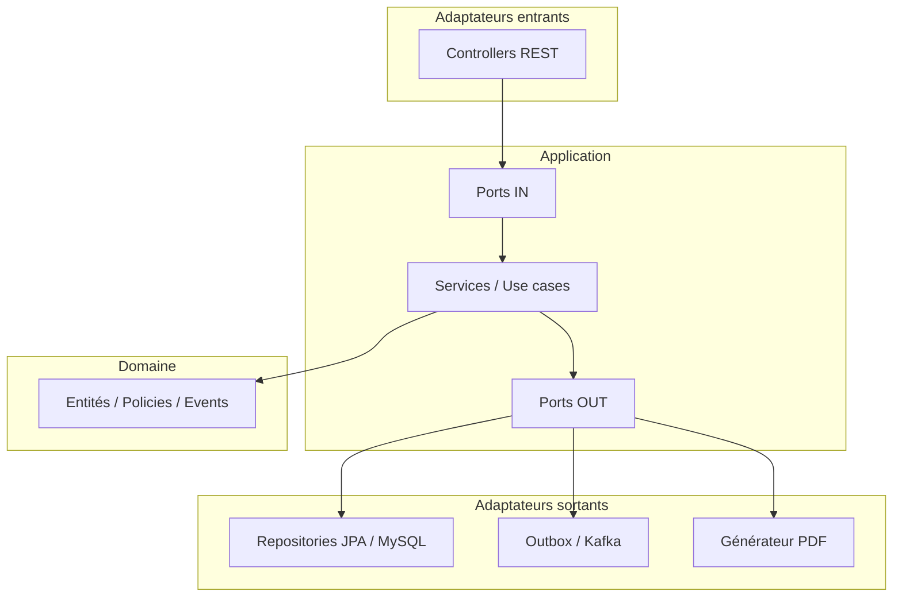

# logistique-hexagonal

Application **Spring Boot 3** organisée en **architecture hexagonale** (ports et adaptateurs). Le dépôt combine un domaine historique de **gestion scolaire** (années académiques, filières, classes, inscriptions, paiements) et un module de **logistique** (livraisons, livreurs, incidents). Le préfixe de package est `com.logistique`.

## Stack

- Java 17+ (pom parent Spring Boot 3.3.x)
- Spring Web, Spring Data JPA, validation Bean Validation
- MySQL (profil `mysql`, `ddl-auto: update`)
- Kafka (publication d’événements via outbox)
- Thymeleaf + génération PDF (reçus de paiement)
- Lombok, JUnit 5, Testcontainers (tests d’intégration optionnels)

## Lancer l’application

```bash
mvn spring-boot:run
```

Par défaut (`application.yml`) : profil actif **`mysql`**, port **8005**, base locale `jdbc:mysql://localhost:8889/hexagonal-ddd` (adapter URL / identifiants selon votre environnement).

Profils utiles :

- **`mysql`** : adaptateurs JPA MySQL pour les dépôts.
- **`inmemory`** ou **`test`** : dépôts en mémoire (`InMemory*Repository`) pour tests ou exécution sans persistance réelle selon configuration.

## Architecture (rôles des couches)

| Couche | Rôle |
|--------|------|
| **Domain** (`domain`) | Modèle métier pur : entités, value objects, politiques, exceptions, événements de domaine. Aucune dépendance framework. |
| **Application** (`application`) | Cas d’usage : commandes, ports (entrée/sortie), services applicatifs, requêtes/vues, orchestration (sagas). |
| **Infrastructure** (`infrastructure`) | Adaptateurs : REST, JPA, Kafka, PDF, configuration Spring. Implémente les ports sortants. |

Les **ports entrants** (`port/in`) décrivent ce que l’application expose (use cases). Les **ports sortants** (`port/out`) décrivent ce dont elle a besoin (repositories, événements, PDF). Les **adaptateurs** dans `infrastructure` branchent ces ports sur des technologies concrètes.



---

## Racine du package `com.logistique`

| Fichier | Rôle |
|---------|------|
| `LogistiqueHexagonalApplication.java` | Point d’entrée Spring Boot ; active le scan JPA sur `infrastructure.persistence` et `infrastructure.projection`, et le scheduling. |

---

## `application/command` — Commandes (données d’entrée des cas d’usage)

Les commandes sont en général des **records** immuables passées aux services.

### `command/anneeacademique`

| Fichier | Rôle |
|---------|------|
| `CloturerAnneeAcademiqueCommand.java` | Identifiant et paramètres pour clôturer une année scolaire. |
| `CreerAnneeAcademiqueCommand.java` | Données pour créer une année académique (libellé, dates, mois). |
| `FermerInscriptionCommand.java` | Référence l’année pour fermer les inscriptions. |
| `ModifierAnneeAcademiqueCommand.java` | Nouvelles dates / libellé pour une année en brouillon. |
| `OuvrirInscriptionCommand.java` | Cible l’année pour rouvrir les inscriptions. |
| `PublierAnneeAcademiqueCommand.java` | Publier une année (passage d’état). |
| `SuspendreInscriptionCommand.java` | Suspendre temporairement les inscriptions. |

### `command/classe`

| Fichier | Rôle |
|---------|------|
| `CreerClasseCommand.java` | Code, nom, filière, montants pour créer une classe. |
| `ModifierAutresFraisClasseCommand.java` | Classe cible + nouveau montant « autres frais ». |
| `ModifierFraisInscriptionClasseCommand.java` | Classe cible + nouveaux frais d’inscription. |
| `ModifierMensualiteClasseCommand.java` | Classe cible + nouvelle mensualité. |

### `command/filiere`

| Fichier | Rôle |
|---------|------|
| `CreerFiliereCommand.java` | Code et nom de filière à créer. |

### `command/iscription` *(typo historique du dossier : « iscription »)*

| Fichier | Rôle |
|---------|------|
| `CreerInscriptionCommand.java` | Données pour inscrire un étudiant (classe, année, etc.). |
| `TransfererEtudiantCommand.java` | Transfert d’inscription vers une autre classe. |

### `command/livraison`

| Fichier | Rôle |
|---------|------|
| `AssignerLivreurCommand.java` | Identifiants livraison et livreur pour assignation. |
| `ConfirmerLivraisonCommand.java` | Identifiant de livraison à confirmer (terminée). |
| `CreerLivraisonCommand.java` | Référence colis et adresse pour nouvelle livraison. |
| `DeclarerIncidentCommand.java` | Livraison + motif d’incident. |
| `DemarrerLivraisonCommand.java` | Passe la livraison en parcours effectif. |
| `ResoudreIncidentCommand.java` | Levée du blocage incident. |

### `command/livreur`

| Fichier | Rôle |
|---------|------|
| `CreerLivreurCommand.java` | Nom du livreur à enregistrer. |

### `command/paiement`

| Fichier | Rôle |
|---------|------|
| `DeclarerPaiementCommand.java` | Déclaration d’un paiement (montant, canal, préuve, etc.). |
| `EtatInscriptionData.java` | Données d’état d’inscription utilisées dans le flux paiement. |

---

## `application/factory`

| Fichier | Rôle |
|---------|------|
| `paiement/PaiementFactory.java` | Fabrique ou assemble des agrégats / objets paiement côté application. |

---

## `application/idempotence`

| Fichier | Rôle |
|---------|------|
| `IdempotenceService.java` | Évite le double traitement d’un même événement ou message. |

---

## `application/mapper`

| Fichier | Rôle |
|---------|------|
| `AnneeAcademiqueMapper.java` | Conversion entre modèles d’application et vues/DTO pour l’année académique. |
| `PaiementSnapshotMapper.java` | Mapping des snapshots de paiement (projection / persistance). |

---

## `application/port/in` — Ports entrants (contrats des cas d’usage)

### `port/in/anneeacademique`

| Fichier | Rôle |
|---------|------|
| `CloturerAnneeScolaireUseCase.java` | Contrat : clôturer l’année. |
| `ConsulterAnneeAcademiqueUseCase.java` | Contrat : lecture / consultation d’une année. |
| `CreerAnneeAcademiqueUseCase.java` | Contrat : création d’année. |
| `FermerInscriptionUseCase.java` | Contrat : fermer les inscriptions. |
| `ModifierAnneeAcademiqueUseCase.java` | Contrat : modifier une année en brouillon. |
| `OuvrirInscriptionUseCase.java` | Contrat : ouvrir les inscriptions. |
| `PublierAnneeAcademiqueUseCase.java` | Contrat : publier l’année. |
| `SuspendreInscriptionUseCase.java` | Contrat : suspendre les inscriptions. |

### `port/in/classe`

| Fichier | Rôle |
|---------|------|
| `CreerClasseUseCase.java` | Contrat : créer une classe. |
| `ModifierAutresFraisClasseUseCase.java` | Contrat : modifier autres frais. |
| `ModifierFraisInscriptionClasseUseCase.java` | Contrat : modifier frais d’inscription. |
| `ModifierMensualiteClasseUseCase.java` | Contrat : modifier la mensualité. |

### `port/in/filiere`

| Fichier | Rôle |
|---------|------|
| `CreerFiliereUseCase.java` | Contrat : créer une filière. |

### `port/in/inscription`

| Fichier | Rôle |
|---------|------|
| `AnnulerInscriptionUseCase.java` | Contrat : annuler une inscription. |
| `CreerInscriptionUseCase.java` | Contrat : créer une inscription. |
| `TransfererEtudiantUseCase.java` | Contrat : transfert entre classes. |

### `port/in/livraison`

| Fichier | Rôle |
|---------|------|
| `AssignerLivreurUseCase.java` | Contrat : assigner un livreur. |
| `ConfirmerLivraisonUseCase.java` | Contrat : confirmer la livraison. |
| `CreerLivraisonUseCase.java` | Contrat : créer une livraison. |
| `DemarrerLivraisonUseCase.java` | Contrat : démarrer le parcours. |
| `GererIncidentUseCase.java` | Contrat : déclarer / résoudre un incident. |
| `SuivreLivraisonUseCase.java` | Contrat : consulter le suivi. |

### `port/in/livreur`

| Fichier | Rôle |
|---------|------|
| `CreerLivreurUseCase.java` | Contrat : créer un livreur. |

### `port/in/paiement`

| Fichier | Rôle |
|---------|------|
| `ConsulterPaiementsUseCase.java` | Contrat : liste / consultation des paiements. |
| `DeclarerPaiementUseCase.java` | Contrat : enregistrer un paiement. |
| `GenererEtatInscriptionUseCase.java` | Contrat : générer l’état d’inscription (document). |
| `GenererRecuPaiementUseCase.java` | Contrat : générer un reçu PDF. |

---

## `application/port/out` — Ports sortants

### `port/out/event`

| Fichier | Rôle |
|---------|------|
| `DomainEventPublisher.java` | Abstraction pour publier des événements de domaine. |
| `EventTransport.java` | Envoi brut d’un événement (clé, payload) vers une couche transport. |
| `inmemory/InMemoryDomainEventPublisher.java` | Implémentation en mémoire pour tests. |

### `port/out/pdf`

| Fichier | Rôle |
|---------|------|
| `PdfGeneratorPort.java` | Génération de PDF à partir de données métier (HTML / template). |

### `port/out/repository`

| Fichier | Rôle |
|---------|------|
| `AnneeAcademiqueRepository.java` | Persistance des années académiques. |
| `ClasseRepository.java` | Persistance des classes. |
| `EtudiantRepository.java` | Persistance des étudiants. |
| `FiliereRepository.java` | Persistance des filières. |
| `InscriptionRepository.java` | Persistance des inscriptions. |
| `LivraisonRepository.java` | Persistance des livraisons. |
| `LivreurRepository.java` | Persistance des livreurs. |
| `PaiementRepository.java` | Persistance des paiements (API riche selon contexte). |

### `port/out/repository/impl` — Implémentations en mémoire

| Fichier | Rôle |
|---------|------|
| `InMemoryAnneeAcademiqueRepository.java` | Stockage Map en mémoire des années. |
| `InMemoryClasseRepository.java` | Idem pour les classes. |
| `InMemoryFiliereRepository.java` | Idem pour les filières. |
| `InMemoryInscriptionRepository.java` | Idem pour les inscriptions. |
| `InMemoryLivraisonRepository.java` | Idem pour les livraisons. |
| `InMemoryLivreurRepository.java` | Idem pour les livreurs. |
| `InMemoryPaiementRepository.java` | Idem pour les paiements. |

---

## `application/query` — Modèles de lecture (CQRS léger)

| Fichier | Rôle |
|---------|------|
| `anneeacademique/AnneeAcademiqueView.java` | Vue lecture pour une année académique. |
| `anneeacademique/MoisAcademiqueView.java` | Vue lecture pour un mois académique. |
| `livraison/LivraisonSuiviView.java` | Vue de suivi d’une livraison (statut, livreur, incident). |
| `paiement/ConsulterPaiementQuery.java` | Paramètres de requête pour consulter des paiements. |
| `paiement/PaiementView.java` | Vue lecture d’un paiement. |

---

## `application/result`

| Fichier | Rôle |
|---------|------|
| `paiement/PaiementResult.java` | Résultat structuré retourné par des opérations sur les paiements. |

---

## `application/saga/inscription`

| Fichier | Rôle |
|---------|------|
| `InscriptionSagaOrchestrator.java` | Orchestre les étapes longues du processus d’inscription (compensations, ordre). |
| `InscriptionSagaState.java` | État courant de la saga d’inscription. |

---

## `application/service/paiement`

| Fichier | Rôle |
|---------|------|
| `MontantValidation.java` | Validation des montants côté application (cohérence avec le domaine). |
| `PaiementApplicationService.java` | Service applicatif transversal pour règles de paiement (orchestration). |
| `PDFGeneratorService.java` | Utilise le port PDF pour produire des documents. |
| `RecuPaiementData.java` | Données préparées pour le template du reçu. |

---

## `application/usecase` — Implémentations des cas d’usage

### `usecase/anneeacademic`

| Fichier | Rôle |
|---------|------|
| `CloturerAnneeAcademiqueService.java` | Implémente la clôture d’année (états, événements). |
| `ConsulterAnneeAcademiqueService.java` | Charge et projette une année pour affichage. |
| `CreerAnneeAcademiqueService.java` | Crée une année et émet les événements associés. |
| `FermerInscriptionService.java` | Passe l’année / le flux à inscriptions fermées. |
| `ModifierAnneeAcademiqueService.java` | Met à jour une année modifiable. |
| `OuvrirInscriptionService.java` | Rouvre les inscriptions. |
| `PublierAnneeAcademiqueService.java` | Publie l’année (passage d’état métier). |
| `SuspendreInscriptionService.java` | Suspend les inscriptions. |

### `usecase/classe`

| Fichier | Rôle |
|---------|------|
| `CreerClasseService.java` | Crée une classe rattachée à une filière existante. |
| `ModifierAutresFraisClasseService.java` | Met à jour les autres frais sur `Classe`. |
| `ModifierFraisInscriptionClasseService.java` | Met à jour les frais d’inscription. |
| `ModifierMensualiteClasseService.java` | Met à jour la mensualité. |

### `usecase/exception`

| Fichier | Rôle |
|---------|------|
| `EtudiantDejaInscritException.java` | Exception applicative : doublon d’inscription. |

### `usecase/filiere`

| Fichier | Rôle |
|---------|------|
| `CreerFiliereService.java` | Crée une filière avec contrôles d’unicité. |

### `usecase/inscription`

| Fichier | Rôle |
|---------|------|
| `AnnulerInscriptionService.java` | Annule une inscription selon les règles métier. |
| `CreerInscriptionService.java` | Crée une inscription et déclenche le flux (paiements, événements). |
| `TransfererEtudiantService.java` | Transfert avec `RegleTransfert` du domaine. |

### `usecase/livraison`

| Fichier | Rôle |
|---------|------|
| `AssignerLivreurService.java` | Assigne un livreur avec politique de capacité (`LivraisonPolicy`). |
| `ConfirmerLivraisonService.java` | Confirme une livraison en `EN_COURS`. |
| `CreerLivraisonService.java` | Crée une livraison en statut initial. |
| `DemarrerLivraisonService.java` | Passe de `ASSIGNEE` à `EN_COURS`. |
| `GererIncidentService.java` | Déclare ou résout un incident sur la livraison. |
| `SuivreLivraisonService.java` | Construit `LivraisonSuiviView` par id ou référence. |

### `usecase/livreur`

| Fichier | Rôle |
|---------|------|
| `CreerLivreurService.java` | Enregistre un nouveau livreur. |

### `usecase/paiement`

| Fichier | Rôle |
|---------|------|
| `ConsulterPaiementsService.java` | Interroge les paiements via le repository. |
| `PayerMensualiteService.java` | Traite le paiement d’une mensualité (agrégats, événements). |

---

## `domain` — Domaine métier

### `domain/shared`

| Fichier | Rôle |
|---------|------|
| `AggregateRoot.java` | Marqueur d’agrégat avec identifiant typé. |
| `EntityId.java` | Classe de base des identifiants typés (égalité, hash). |

### `domain/entity/academic`

| Fichier | Rôle |
|---------|------|
| `AbstractEtatAnnee.java` | Comportement commun des états d’année académique. |
| `AnneeAcademique.java` | Agrégat année : cycle de vie, inscriptions, publication. |
| `AnneeAcademiqueId.java` | Identifiant de l’année académique. |
| `AnneeBrouillon.java` | État brouillon. |
| `AnneeCloturee.java` | État clôturé. |
| `AnneePubliee.java` | État publié. |
| `DatesAnnee.java` | Value object des dates de début/fin. |
| `EtatAnnee.java` | Interface ou type des états. |
| `InscriptionsFermees.java` | État : inscriptions fermées. |
| `InscriptionsOuvertes.java` | État : inscriptions ouvertes. |
| `InscriptionsSuspendues.java` | État : inscriptions suspendues. |
| `MoisAcademique.java` | Mois dans le calendrier académique. |
| `Statut.java` | Énumération / valeur de statut pour l’année. |

### `domain/entity/inscription`

| Fichier | Rôle |
|---------|------|
| `EtatInscription.java` | États du cycle d’inscription (ex. en attente, payée, confirmée). |
| `Inscription.java` | Agrégat inscription : règles de confirmation, transfert, invalidation. |
| `InscriptionCreationSnapshot.java` | Snapshot des données à la création (factory). |
| `InscriptionId.java` | Identifiant composite / typé de l’inscription. |
| `StatutInscription.java` | Statut métier complémentaire si présent. |

### `domain/entity/livraison`

| Fichier | Rôle |
|---------|------|
| `AdresseLivraison.java` | Adresse de livraison (value object). |
| `Livraison.java` | Agrégat livraison : assignation, démarrage, incidents, confirmation. |
| `LivraisonId.java` | UUID de livraison. |
| `ReferenceColis.java` | Référence unique de suivi du colis. |
| `StatutLivraison.java` | Cycle de vie : créée, assignée, en cours, bloquée, confirmée. |

### `domain/entity/livreur`

| Fichier | Rôle |
|---------|------|
| `Livreur.java` | Agrégat livreur (identité, nom). |
| `LivreurId.java` | Identifiant du livreur. |
| `NomLivreur.java` | Nom du livreur (value object). |

### `domain/entity/paiement`

| Fichier | Rôle |
|---------|------|
| `CanalPaiement.java` | Canal (espèces, mobile money, etc.). |
| `DeclarationPaiement.java` | Déclaration brute d’un paiement. |
| `NombreDeMois.java` | Nombre de mois (mensualités). |
| `Paiement.java` | Agrégat ou entité paiement selon le modèle. |
| `PaiementId.java` | Identifiant de paiement. |
| `PaiementSnapshot.java` | Snapshot pour projection / historique. |
| `StatutPaiement.java` | Statut du paiement. |
| `TypePaiement.java` | Type (inscription, mensualité, etc.). |

### `domain/entity/school`

| Fichier | Rôle |
|---------|------|
| `Classe.java` | Agrégat classe : frais, mensualité, rattachement à une filière. |
| `CodeClasse.java` | Code normalisé de la classe. |
| `CodeFiliere.java` | Code de filière. |
| `Filiere.java` | Entité filière. |
| `Montant.java` | Montant monétaire encapsulé. |
| `NomClasse.java` | Nom affiché de la classe. |
| `NomFiliere.java` | Nom de la filière. |

### `domain/entity/student`

| Fichier | Rôle |
|---------|------|
| `Etudiant.java` | Entité étudiant (identité, matricule). |
| `Matricule.java` | Value object matricule. |

### `domain/event/anneeacademic`

| Fichier | Rôle |
|---------|------|
| `AnneeAcademiqueClotureeEvent.java` | Événement : année clôturée. |
| `AnneeAcademiqueCreeeEvent.java` | Événement : année créée. |
| `AnneeAcademiqueEvent.java` | Type de base ou marqueur des événements année. |
| `AnneeAcademiqueModifieEvent.java` | Événement : année modifiée. |
| `AnneeAcademiquePublieeEvent.java` | Événement : année publiée. |
| `InscriptionsFermeesEvent.java` | Événement : inscriptions fermées. |
| `InscriptionsOuvertesEvent.java` | Événement : inscriptions ouvertes. |
| `InscriptionsSuspenduesEvent.java` | Événement : inscriptions suspendues. |

### `domain/event/inscription`

| Fichier | Rôle |
|---------|------|
| `InscriptionConfirmeeEvent.java` | Inscription confirmée après paiement. |
| `InscriptionCreeeEvent.java` | Nouvelle inscription (déclenche paiements). |
| `InscriptionEvent.java` | Base des événements inscription. |
| `InscriptionInvalideeEvent.java` | Inscription invalidée. |

### `domain/event/paiement`

| Fichier | Rôle |
|---------|------|
| `PaiementInitialEchoueEvent.java` | Échec du premier paiement attendu. |
| `PaiementInitialValideEvent.java` | Premier paiement validé. |

### `domain/event/shared`

| Fichier | Rôle |
|---------|------|
| `DomainEvent.java` | Contrat commun des événements de domaine. |
| `EventAggregateRoot.java` | Base d’agrégat avec collecte et émission d’événements. |

### `domain/exception`

| Fichier | Rôle |
|---------|------|
| `AnneeAcadiqueException.java` | Erreur métier année *(nom historique « Acadique »)*. |
| `DelaiInscriptionException.java` | Dépassement de délai d’inscription. |
| `LogistiqueException.java` | Erreur métier logistique générique. |
| `LogistiqueNotFoundException.java` | Ressource logistique introuvable. |
| `ScolariteException.java` | Erreur métier scolarité générique. |
| `ScolariteNotFoundException.java` | Ressource scolarité introuvable. |
| `TransfertNonAutoriseException.java` | Transfert refusé par la règle métier. |

### `domain/policy/inscription`

| Fichier | Rôle |
|---------|------|
| `InscriptionProcessPolicy.java` | Vérifie qu’une action d’inscription est autorisée (ex. année ouverte). |
| `RegleTransfert.java` | Interface de la règle de transfert entre classes. |
| `RegleTransfertSousDelai.java` | Implémentation : transfert autorisé sous délai configurable. |

### `domain/policy/livraison`

| Fichier | Rôle |
|---------|------|
| `LivraisonPolicy.java` | Plafond de livraisons simultanées par livreur. |

### `domain/policy/paiement`

| Fichier | Rôle |
|---------|------|
| `PaiementPolicy.java` | Règles transverses sur les paiements. |

### `domain/result/paiement`

| Fichier | Rôle |
|---------|------|
| `PaiementProcessingResult.java` | Résultat du traitement métier d’un paiement. |

### `domain/service/paiement`

| Fichier | Rôle |
|---------|------|
| `MontantValidation.java` | Validation des montants au niveau domaine. |
| `PaiementComputation.java` | Calculs sur échéances / soldes. |
| `PaiementMensualiteProcessor.java` | Traitement d’une mensualité dans le modèle. |
| `PlanPaiementInitializer.java` | Initialisation du plan de paiements à l’inscription. |

---

## `infrastructure` — Adaptateurs techniques

### `infrastructure/config`

| Fichier | Rôle |
|---------|------|
| `RegleTransfertConfiguration.java` | Expose un bean `RegleTransfert` avec délai lu depuis `logistique.transfert`. |
| `RetryConfig.java` | Configuration Spring Retry (listeners, politique). |
| `TimeConfiguration.java` | Beans d’horloge / temps (tests ou logique dépendante du temps). |

### `infrastructure/event`

| Fichier | Rôle |
|---------|------|
| `SpringDomainEventPublisher.java` | Publie via le bus Spring `ApplicationEventPublisher`. |
| `TestDomainEventPublisher.java` | Publisher pour tests (capture des événements). |
| `kafka/KafkaEventTransport.java` | Implémente `EventTransport` avec `KafkaTemplate`. |
| `listener/paiement/PaiementEventHandler.java` | Écoute des événements liés aux paiements (mise à jour, projections). |
| `outbox/OutboxEventScheduler.java` | Planifie l’envoi des événements outbox. |
| `outbox/OutboxEventTransport.java` | Transport depuis la table outbox. |
| `outbox/OutboxKafkaPublisherJob.java` | Job qui lit l’outbox et publie sur Kafka (`logistique-anneeacademique-events`). |
| `outbox/publisher/CompositeDomainEventPublisher.java` | Combine plusieurs publishers (ex. Spring + outbox). |

### `infrastructure/pdf`

| Fichier | Rôle |
|---------|------|
| `ThymeleafPdfGeneratorAdapter.java` | Implémente `PdfGeneratorPort` (HTML Thymeleaf → PDF). |

### `infrastructure/persistence/anneeacademique`

| Fichier | Rôle |
|---------|------|
| `StatutAnneeAcademique.java` | Énumération JPA / persistance du statut année. |
| `adapter/AnneeAcademiqueRepositoryMySqlAdapter.java` | Implémente `AnneeAcademiqueRepository` via JPA. |
| `entity/AnneeAcademiqueJpaEntity.java` | Entité JPA année. |
| `entity/AnneeMoisJpaEntity.java` | Entité JPA mois lié à l’année. |
| `mapper/AnneeAcademiquePersistenceMapper.java` | Domaine ↔ entités JPA. |
| `mapper/EtatAnneeFactory.java` | Reconstruction des états domaine depuis la persistance. |
| `mapper/MoisAcademiquePersistenceMapper.java` | Mapping des mois. |
| `repository/AnneeAcademiqueJpaRepository.java` | Spring Data repository année. |
| `repository/AnneeMoisJpaRepository.java` | Spring Data repository mois. |

### `infrastructure/persistence/classe`

| Fichier | Rôle |
|---------|------|
| `adapter/ClasseMysqlRepositoryAdapter.java` | Implémente `ClasseRepository` (profil `mysql`). |
| `entity/ClasseJpaEntity.java` | Table `classe`. |
| `mapper/ClassePersistenceMapper.java` | Mapping domaine / JPA. |
| `repository/ClasseJpaRepository.java` | Spring Data pour `ClasseJpaEntity`. |

### `infrastructure/persistence/etudiant`

| Fichier | Rôle |
|---------|------|
| `adapter/EtudiantMysqlRepositoryAdapter.java` | Implémente `EtudiantRepository`. |
| `entity/EtudiantJpaEntity.java` | Table étudiant. |
| `mapper/EtudiantPersistenceMapper.java` | Mapping étudiant. |
| `repository/EtudiantJpaRepository.java` | Repository Spring Data. |

### `infrastructure/persistence/filiere`

| Fichier | Rôle |
|---------|------|
| `entity/FiliereJpaEntity.java` | Table filière et relations. |
| `mapper/FilierePersistenceMapper.java` | Mapping filière. |

### `infrastructure/persistence/idempotence`

| Fichier | Rôle |
|---------|------|
| `ProcessedEventJpaEntity.java` | Stocke les ids d’événements déjà traités. |
| `ProcessedEventJpaRepository.java` | Accès Spring Data à l’idempotence. |

### `infrastructure/persistence/inscription`

| Fichier | Rôle |
|---------|------|
| `adapter/InscriptionMysqlRepositoryAdapter.java` | Implémente `InscriptionRepository`. |
| `entity/InscriptionJpaEntity.java` | Ligne d’inscription en base. |
| `entity/InscriptionJpaId.java` | Classe `@Embeddable` ou id composite JPA. |
| `mapper/InscriptionPersistenceMapper.java` | Mapping inscription. |
| `repository/InscriptionJpaRepository.java` | Repository Spring Data. |

### `infrastructure/persistence/livraison`

| Fichier | Rôle |
|---------|------|
| `adapter/LivraisonMysqlRepositoryAdapter.java` | Implémente `LivraisonRepository` avec requêtes fetch join. |
| `entity/LivraisonJpaEntity.java` | Table livraison. |
| `mapper/LivraisonPersistenceMapper.java` | Mapping + référence livreur JPA. |
| `repository/LivraisonJpaRepository.java` | Requêtes dérivées et JPQL (comptage actifs). |

### `infrastructure/persistence/livreur`

| Fichier | Rôle |
|---------|------|
| `adapter/LivreurMysqlRepositoryAdapter.java` | Implémente `LivreurRepository`. |
| `entity/LivreurJpaEntity.java` | Table livreur. |
| `mapper/LivreurPersistenceMapper.java` | Mapping livreur. |
| `repository/LivreurJpaRepository.java` | Repository Spring Data. |

### `infrastructure/persistence/outbox`

| Fichier | Rôle |
|---------|------|
| `OutboxDomainEventPublisher.java` | Écrit les événements dans la table outbox. |
| `dto/OutboxEventPayload.java` | Structure du payload sérialisé. |
| `entity/OutboxEventJpaEntity.java` | Ligne outbox (statut, payload, agrégat). |
| `entity/OutboxStatus.java` | Statut de publication (en attente, envoyé, erreur). |
| `exception/OutboxSerializationException.java` | Erreur de sérialisation outbox. |
| `mapper/OutboxEventMapper.java` | Conversion événement ↔ entité outbox. |
| `repository/OutboxEventJpaRepository.java` | Lecture / mise à jour des événements outbox. |

### `infrastructure/persistence/paiement`

| Fichier | Rôle |
|---------|------|
| `adapter/PaiementPersistenceContext.java` | Contexte technique pour requêtes complexes paiement. |
| `adapter/PaiementRepositoryMySqlAdapter.java` | Implémentation principale de `PaiementRepository`. |
| `entity/PaiementJpaEntity.java` | Table paiement. |
| `entity/StatutJpaPaiement.java` | Enum / mapping statut côté JPA. |
| `mapper/PaiementPersistenceMapper.java` | Mapping paiement. |
| `PaiementJpaRepositoryAdapter.java` | Adapter secondaire ou délégué selon conception. |
| `repository/PaiementJpaRepository.java` | Spring Data pour paiements. |

### `infrastructure/projection/inscription`

| Fichier | Rôle |
|---------|------|
| `entity/AnneeAcademiqueProjection.java` | Table de lecture optimisée pour l’année (vue / CQRS). |
| `handler/AnneeAcademiqueModifierHandler.java` | Met à jour la projection quand l’année change. |
| `handler/AnneeAcademiqueProjectionHandler.java` | Crée / alimente la projection à la création d’année. |
| `repository/AnneeAcademiqueProjectionRepository.java` | Accès JPA à la projection. |

### `infrastructure/web` — Couche HTTP

| Fichier | Rôle |
|---------|------|
| `ValidationExceptionHandler.java` | Réponses 400 (validation) et erreurs métier logistique (400/404). |
| `advice/ApiError.java` | Corps d’erreur API standardisé. |
| `advice/GlobalControllerAdvice.java` | Gestion centralisée d’exceptions HTTP. |
| `anneeacdemique/AnneeAcademiqueController.java` | Endpoints REST année académique *(dossier avec typo « anneeacdemique »)*. |
| `anneeacdemique/AnneeAcademiqueMapper.java` | Mappe requêtes HTTP vers commandes. |
| `anneeacdemique/request/CreerAnneeAcademiqueRequest.java` | DTO JSON création d’année. |
| `classe/ClasseController.java` | Endpoints classes. |
| `classe/ClasseMapper.java` | Mapping requêtes → commandes classe. |
| `classe/request/CreerClasseRequest.java` | DTO création classe. |
| `classe/request/ModifierAutresFraisRequest.java` | DTO modification autres frais. |
| `classe/request/ModifierFraisInscriptionRequest.java` | DTO frais d’inscription. |
| `classe/request/ModifierMensualiteRequest.java` | DTO mensualité. |
| `classe/response/ClasseResponse.java` | DTO de réponse classe. |
| `filiere/FiliereController.java` | Endpoints filières. |
| `filiere/FiliereMapper.java` | Mapping filière. |
| `filiere/request/CreerFiliereRequest.java` | DTO création filière. |
| `inscription/InscriptionController.java` | Endpoints inscriptions. |
| `inscription/InscriptionWebMapper.java` | Mapping inscription web ↔ commandes. |
| `inscription/request/CreerInscriptionRequest.java` | DTO création inscription. |
| `inscription/response/InscriptionResponse.java` | DTO réponse inscription. |
| `livraison/LivraisonController.java` | API REST livraisons (création, assignation, suivi, incidents…). |
| `livraison/LivraisonWebMapper.java` | Conversion requêtes / vues livraison. |
| `livraison/LivreurController.java` | `POST /api/livreurs` pour créer un livreur. |
| `livraison/request/AssignerLivreurRequest.java` | Corps JSON assignation. |
| `livraison/request/CreerLivraisonRequest.java` | Corps JSON création livraison. |
| `livraison/request/CreerLivreurRequest.java` | Corps JSON création livreur. |
| `livraison/request/DeclarerIncidentRequest.java` | Motif d’incident. |
| `livraison/response/LivraisonSuiviResponse.java` | Réponse JSON de suivi. |
| `paiement/PaiementController.java` | Endpoints déclaration / consultation paiements. |
| `paiement/PaiementMapper.java` | Mapping paiement. |
| `paiement/PaiementStatutMapper.java` | Conversion statut domaine ↔ présentation. |
| `paiement/request/DeclarerPaiementRequest.java` | DTO déclaration paiement. |
| `validation/CheckPreuvePaiement.java` | Annotation de validation personnalisée. |
| `validation/PaiementRequest.java` | Interface ou contrat des champs paiement. |
| `validation/PaiementSelonCanalValidator.java` | Valide les champs selon le canal. |
| `validation/PreuvePaiementSelonCanalValidator.java` | Valide la preuve selon le canal. |
| `validation/ValidPaiement.java` | Annotation regroupant la validation paiement. |
| `validation/ValidPreuvePaiement.java` | Annotation validation preuve. |

---

## `src/test/java/com/logistique` — Tests

| Fichier | Rôle |
|---------|------|
| `application/usecase/anneeacademic/AnneeAcademiqueTestFactory.java` | Fabrique de données pour tests d’année académique. |
| `application/usecase/anneeacademic/CreerAnneeAcademiqueServiceTest.java` | Tests d’intégration Spring du service de création d’année. |
| `application/usecase/anneeacademic/ModifierAnneeAcademiqueServiceTest.java` | Tests d’intégration de modification d’année. |
| `application/usecase/classe/CreerClasseUseCaseTest.java` | Test unitaire du cas d’usage création de classe (mémoire). |
| `application/usecase/classe/ModifierAutresFraisClasseServiceTest.java` | Test modification autres frais. |
| `application/usecase/classe/ModifierFraisInscriptionServiceTest.java` | Test modification frais d’inscription. |
| `application/usecase/classe/ModifierMensualiteClasseServiceTest.java` | Test modification mensualité. |
| `application/usecase/filiere/CreerFiliereTest.java` | Test création filière. |
| `application/usecase/inscription/CreerInscriptionServiceTest.java` | Test service d’inscription. |
| `application/usecase/inscription/CreerInscriptionUseCaseTest.java` | Test du port création inscription. |
| `application/usecase/livraison/LivraisonUseCaseTest.java` | Scénarios principaux livraison (repos mémoire). |
| `domain/entity/academic/AnneeAcademiqueTest.java` | Tests unitaires du domaine année académique. |
| `domain/entity/inscription/InscriptionTest.java` | Tests comportement inscription. |
| `domain/entity/livraison/LivraisonTest.java` | Tests cycle de vie livraison et incidents. |
| `domain/entity/school/ClasseTest.java` | Tests entité `Classe`. |
| `domain/entity/school/ClasseTestFactory.java` | Factory pour tests de classe. |
| `domain/entity/school/CodeClasseTest.java` | Tests value object `CodeClasse`. |
| `domain/entity/school/FiliereTest.java` | Tests filière. |
| `domain/entity/school/NomClasseTest.java` | Tests `NomClasse`. |
| `domain/policy/livraison/LivraisonPolicyTest.java` | Tests politique de capacité livreur. |
| `infrastructure/anneeacademique/AnneeAcademiqueRepositoryMySqlTest.java` | Test d’intégration MySQL (Testcontainers si Docker disponible). |

---

## Ressources `src/main/resources`

| Fichier | Rôle |
|---------|------|
| `application.yml` | Configuration Spring (datasource, JPA, Kafka, port, préfixe `logistique.transfert`). |
| `templates/recu-paiement.html` | Modèle Thymeleaf du reçu de paiement pour export PDF. |

---

## Fichiers à la racine du dépôt (hors `src`)

| Fichier | Rôle |
|---------|------|
| `pom.xml` | Dépendances Maven, module `logistique-hexagonal`, compilation Java, Lombok. |
| `docker-compose.yml` | Zookeeper + Kafka sur réseau `logistique-net`. |
| `docker-compose-kafka.yml` | Variante Kafka (réseau externe `logistique-net`). |
| `docker-compose-zookeeper.yml` | Zookeeper seul pour composition multi-fichiers. |

---

## Note sur les noms de dossiers

- Le package `application/command/iscription` et le dossier web `anneeacdemique` sont des **typos historiques** ; les renommer toucherait de nombreux imports. Leur rôle fonctionnel est décrit ci-dessus tel quel.

Pour toute évolution (scinder le module scolarité du module logistique en sous-modules Maven), il est préférable de le faire dans une branche dédiée avec outils de refactorisation IDE.
